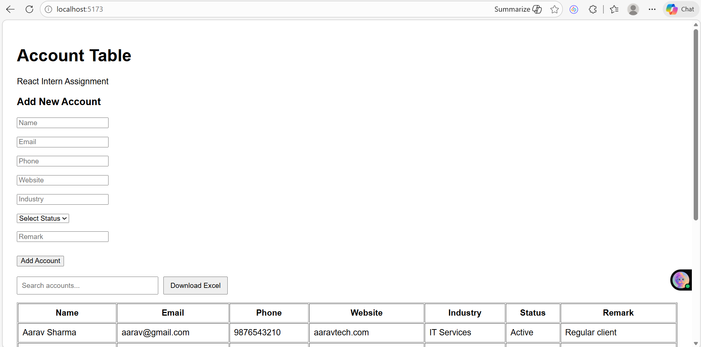
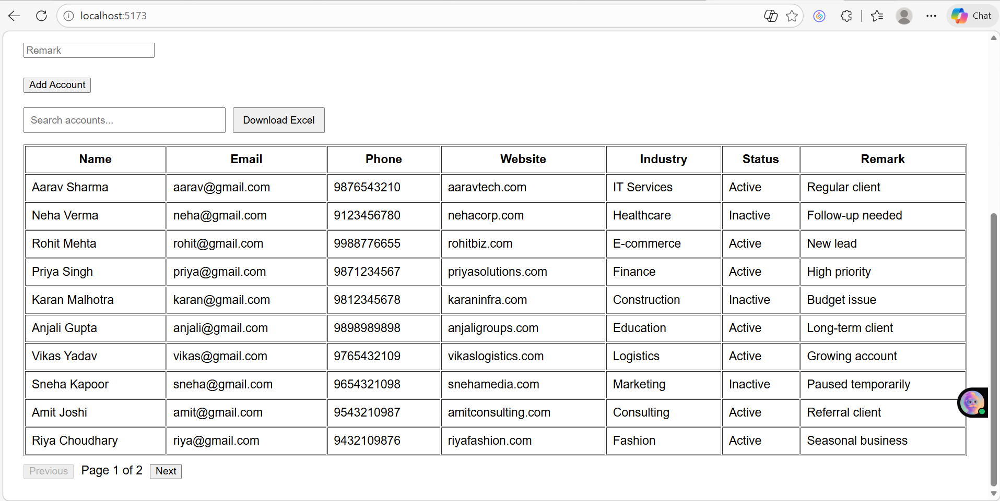
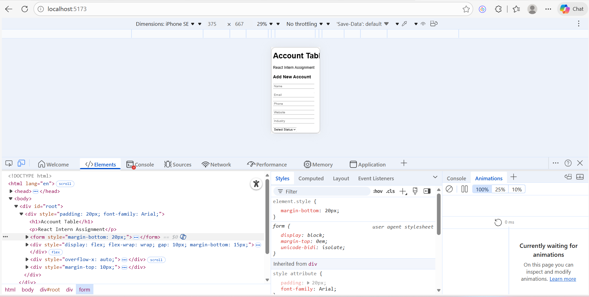

# React Account Table

ReactJS assignment implementing an account management table with filtering, pagination, Excel export, and responsive design.

---

## 🚀 Features

- Display account data in a table
- Pagination (10 records per page)
- Global search / filtering
- Column sorting
- Add new account using form validation
- Excel download (exports filtered data if search is applied)
- Mobile responsive design

---

## 🛠 Tech Stack

- React + Vite
- Redux Toolkit
- React Hook Form
- XLSX (Excel export)

---

## ▶️ How to Run Locally

```bash
npm install
npm run dev

📱 Responsive Design

Desktop: Full table view with pagination

Mobile: Horizontally scrollable table for usability

### 🖥 Desktop View



### 📱 Mobile View



👩‍💻 Author

Sugandha


